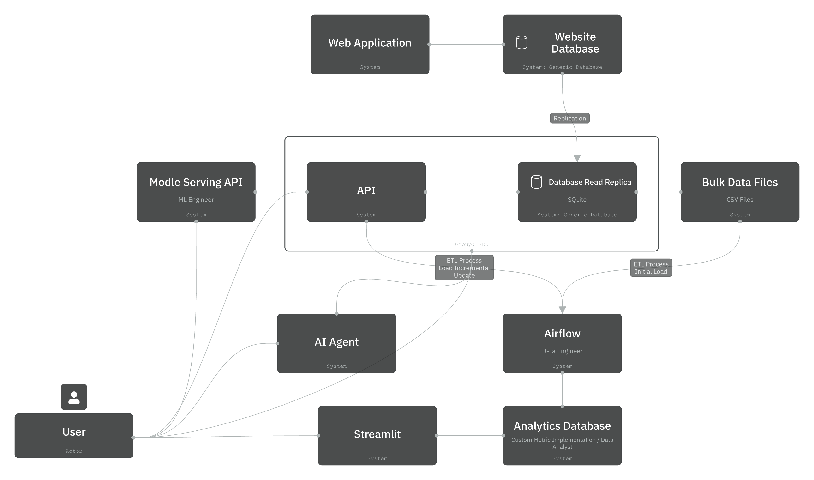

FastAPI Project base on Hands-On API for AI and Data Science  

Parts at this moment:
- API itself
- SDK for the API
- Custom Metrics
- Airflow
- Streamlit
- AI
- AI Agent
- Docs

For better understanding each one check the readme of each folder
You can see the Project Structure within Icepanel Link (This might be broken later on):
[Icepanel Project](https://s.icepanel.io/OZUI0VQDmB5kHP/P421)

Aditional Links:
* [Hands-On API for AI and Data Science Book Link](https://handsonapibook.com/)
* [Ryan Day](https://www.linkedin.com/in/ryanday1/)
* [SportsWorldCentral](https://sportsworldcentral.com/)
