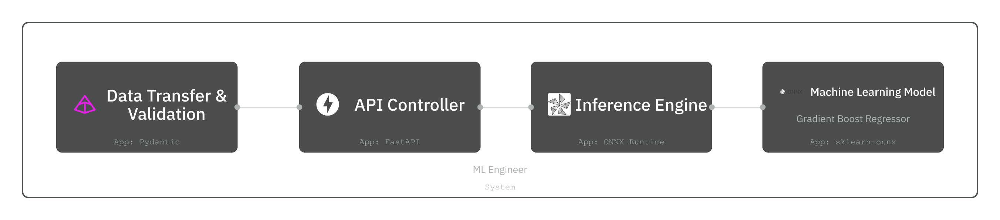

* Train Gradient Boost Regressor-A classification model- with scikit-learn
* Convert the model to an ONNX format for inference
* Inference ONNX format models with ONNX Runtime and provide an endpoint with FastAPI for real-time prediction
